<div align="center">

[](https://www.infnet.edu.br)
[](https://www.infnet.edu.br)
[-green?style=for-the-badge)](https://www.infnet.edu.br)

[](https://openjdk.org)
[](https://spring.io/projects/spring-boot)
[](https://nextjs.org/)
[](https://www.typescriptlang.org/)
[](https://maven.apache.org/)
[](https://www.docker.com/)
[](https://www.usebruno.com)
[](https://github.com/andrebecker84)
[](LICENSE)

# Infnet Hub — TP1: Monólito Simples com Spring Boot

> **Plataforma educacional monolítica com feed social, vagas de carreira e comunidades acadêmicas. Back-end em Spring Boot seguindo design em camadas, APIs REST, princípios SOLID e DDD. Front-end em Next.js 15 consumindo o back-end via REST.**

[](https://linkedin.com/in/becker84)
[](https://github.com/andrebecker84)

</div>

---

## Índice

- [Sobre o Projeto](#sobre-o-projeto)
- [Arquitetura](#arquitetura)
- [Estrutura do Projeto](#estrutura-do-projeto)
- [Como Executar](#como-executar)
- [Testes com Bruno](#testes-com-bruno)
- [API REST](#api-rest)
- [Tecnologias](#tecnologias)
- [Relatório Técnico](#relatório-técnico)
- [Licença](#licença)
- [Créditos](#créditos)

---

## Sobre o Projeto

O **Infnet Hub** é uma plataforma educacional monolítica desenvolvida como primeira entrega do Projeto de Bloco da disciplina de Engenharia de Softwares Escaláveis. O sistema gerencia um feed social acadêmico com publicações, curtidas, comentários, vagas de carreira e perfis de usuário com diferentes papéis institucionais (Aluno, Professor, Secretaria, Coordenador).

A arquitetura segue o padrão de camadas do Spring MVC com separação clara de responsabilidades — Controller, Service e Repository — aplicando princípios SOLID e modelagem Domain-Driven Design. O front-end em Next.js 15 consome o back-end via REST, demonstrando a integração completa entre as duas camadas.

---

## Screenshots

| Tela de Acesso | Feed |
|---|---|
|  |  |

---

## Arquitetura

```
┌────────────────────────────────────────────────────────┐
│              Front-End (Next.js 15 + TypeScript)       │
│                   localhost:3000                       │
└─────────────────────────┬──────────────────────────────┘
                          │ HTTP / REST (JSON)
                          │ CORS permitido: localhost:3000
                          ▼
┌────────────────────────────────────────────────────────┐
│              Back-End (Spring Boot 4.0.6)              │
│                   localhost:8080                       │
│  ┌─────────────┐  ┌──────────────┐  ┌───────────────┐  │
│  │ Controller  │→ │   Service    │→ │  Repository   │  │
│  │  (REST API) │  │  (Negócio)   │  │  (JPA / H2)   │  │
│  └─────────────┘  └──────────────┘  └───────────────┘  │
│  ┌─────────────┐  ┌──────────────┐                     │
│  │    DTOs     │  │  Exception   │                     │
│  │ Req/Resp    │  │   Handler    │                     │
│  └─────────────┘  └──────────────┘                     │
└────────────────────────────────────────────────────────┘
```

**Decisões de design:**

| Decisão                | Implementação                                   | Motivo                                        |
|------------------------|-------------------------------------------------|-----------------------------------------------|
| Design em camadas      | Controller → Service → Repository               | Separação de responsabilidades (SRP)          |
| Interface de serviço   | `PostService` / `PostServiceImpl`               | Open/Closed + Dependency Inversion            |
| DTOs Record (Java)     | `PostRequestDTO`, `PostResponseDTO`             | Anti-corruption layer entre API e domínio     |
| H2 em memória          | `spring.datasource.url=jdbc:h2:mem:infnethubdb` | Desenvolvimento sem dependências externas     |
| DataLoader             | `ApplicationRunner` com dados fictícios         | Demonstração funcional desde o primeiro start |
| GlobalExceptionHandler | `@RestControllerAdvice`                         | Tratamento centralizado de erros (404, 400)   |

### DDD — Bounded Contexts

| Conceito              | Valor                                   |
|-----------------------|-----------------------------------------|
| **Domain**            | Plataforma Educacional Infnet Hub       |
| **Core Subdomain**    | Feed Social e Oportunidades de Carreira |
| **Support Subdomain** | Autenticação, validação e persistência  |
| **Bounded Contexts**  | `Usuário` · `Post` · `Vaga`             |
| **Aggregate Roots**   | `Usuario`, `Post`, `Vaga`               |

---

## Estrutura do Projeto

```
TP1-PB_monolito/
├── bruno/                              # Coleção de testes de API (Bruno)
│   ├── bruno.json
│   ├── environments/local.bru
│   ├── Usuarios/
│   ├── Posts/
│   ├── Vagas/
│   └── Comentarios/
├── doc/                                # Documentação técnica
│   ├── images/card.svg
│   ├── screenshots/
│   └── RELATORIO_TP1-PB.md
├── frontend/                           # Next.js 15 + TypeScript
│   └── src/
│       ├── app/                        # Pages (App Router)
│       ├── components/                 # Componentes reutilizáveis
│       ├── hooks/                      # Custom hooks
│       ├── services/                   # Clientes HTTP (fetch)
│       ├── types/                      # Tipos TypeScript
│       └── utils/                      # Utilitários compartilhados
└── src/main/java/com/andre/monolito_infnethub/
    ├── config/                         # CorsConfig, DataLoader
    ├── controller/                     # Camada HTTP (5 controllers)
    ├── dto/                            # Records de entrada e saída
    ├── exception/                      # GlobalExceptionHandler
    ├── model/                          # Entidades JPA + Enums
    ├── repository/                     # Interfaces JpaRepository
    └── service/impl/                   # Regras de negócio
```

---

## Como Executar

**Pré-requisitos:** JDK 25, Maven 3.9+, Node.js 20+

### Back-End

```bash
# Na raiz do projeto
./mvnw spring-boot:run
```

Acessa:
- API: `http://localhost:8080/api/v1/posts`
- H2 Console: `http://localhost:8080/h2-console`
  - JDBC URL: `jdbc:h2:mem:infnethubdb`
  - User: `sa` / Password: *(vazio)*

### Front-End

```bash
cd frontend
npm install
npm run dev
```

Acessa: `http://localhost:3000`

### Docker (back-end + front-end juntos)

```bash
docker compose up --build
```

---

## Testes com Bruno

1. Instale o **Bruno** em [usebruno.com](https://www.usebruno.com)
2. Abra o Bruno → **Open Collection** → selecione a pasta `bruno/`
3. Selecione o environment **local** (canto superior direito)
4. Execute as requisições nas pastas **Usuarios**, **Posts**, **Vagas** e **Comentarios**

---

## API REST

**Base URL:** `http://localhost:8080`

### Usuários

| Método   | Endpoint                | Descrição               | Status    |
|----------|-------------------------|-------------------------|-----------|
| `GET`    | `/api/v1/usuarios`      | Lista todos os usuários | 200       |
| `GET`    | `/api/v1/usuarios/{id}` | Busca usuário por ID    | 200 / 404 |
| `POST`   | `/api/v1/usuarios`      | Cria novo usuário       | 201       |
| `PUT`    | `/api/v1/usuarios/{id}` | Atualiza usuário        | 200 / 404 |
| `DELETE` | `/api/v1/usuarios/{id}` | Remove usuário          | 204 / 404 |

### Posts

| Método   | Endpoint             | Descrição            | Status    |
|----------|----------------------|----------------------|-----------|
| `GET`    | `/api/v1/posts`      | Lista todos os posts | 200       |
| `GET`    | `/api/v1/posts/{id}` | Busca post por ID    | 200 / 404 |
| `POST`   | `/api/v1/posts`      | Cria novo post       | 201       |
| `PUT`    | `/api/v1/posts/{id}` | Atualiza post        | 200 / 404 |
| `DELETE` | `/api/v1/posts/{id}` | Remove post          | 204 / 404 |

### Curtidas

| Método | Endpoint                                         | Descrição                   | Status |
|--------|--------------------------------------------------|-----------------------------|--------|
| `GET`  | `/api/v1/posts/{postId}/curtidas`                | Lista quem curtiu um post   | 200    |
| `POST` | `/api/v1/posts/{postId}/curtidas?usuarioId={id}` | Curtir / descurtir (toggle) | 200    |

### Comentários

| Método   | Endpoint                                  | Descrição                    | Status    |
|----------|-------------------------------------------|------------------------------|-----------|
| `GET`    | `/api/v1/posts/{postId}/comentarios`      | Lista comentários de um post | 200       |
| `POST`   | `/api/v1/posts/{postId}/comentarios`      | Adiciona comentário          | 201       |
| `PUT`    | `/api/v1/posts/{postId}/comentarios/{id}` | Edita comentário             | 200 / 404 |
| `DELETE` | `/api/v1/posts/{postId}/comentarios/{id}` | Remove comentário            | 204 / 404 |

### Vagas

| Método   | Endpoint                    | Descrição                           | Status    |
|----------|-----------------------------|-------------------------------------|-----------|
| `GET`    | `/api/v1/vagas`             | Lista todas as vagas                | 200       |
| `GET`    | `/api/v1/vagas/{id}`        | Busca vaga por ID                   | 200 / 404 |
| `GET`    | `/api/v1/vagas/tipo/{tipo}` | Filtra por tipo (CLT, ESTAGIO, PJ…) | 200       |
| `POST`   | `/api/v1/vagas`             | Cria nova vaga                      | 201       |
| `PUT`    | `/api/v1/vagas/{id}`        | Atualiza vaga                       | 200 / 404 |
| `DELETE` | `/api/v1/vagas/{id}`        | Remove vaga                         | 204 / 404 |

**Exemplo de payload — Criar Post:**
```json
{
  "titulo": "Novidades do Bloco 5",
  "conteudo": "Conteúdo do post aqui.",
  "autorId": 1
}
```

---

## Tecnologias

| Camada             | Tecnologia                                  |
|--------------------|---------------------------------------------|
| Linguagem          | Java 25 (Eclipse Temurin)                   |
| Framework Back-End | Spring Boot 4.0.6                           |
| Persistência       | Spring Data JPA + H2 Database (in-memory)   |
| Validação          | Spring Validation (Jakarta Bean Validation) |
| Boilerplate        | Lombok                                      |
| Front-End          | Next.js 15 + TypeScript + React 19          |
| Estilização        | CSS Modules                                 |
| Testes de API      | Bruno                                       |
| Containerização    | Docker + Docker Compose                     |
| Build              | Maven 3.9                                   |

---

## Relatório Técnico

A documentação completa da arquitetura — diagramas de componentes, diagramas de sequência, modelagem DDD, princípios SOLID e design patterns aplicados — está em [`doc/RELATORIO_TP1-PB.md`](doc/RELATORIO_TP1-PB.md).

---

## Licença

Distribuído sob a licença MIT. Veja [LICENSE](LICENSE) para mais informações.

---

## Créditos

| Asset                   | Autor                                                                 | Licença                                                         |
|-------------------------|-----------------------------------------------------------------------|-----------------------------------------------------------------|
| Foto da página de login | [Meredith Spencer](https://unsplash.com/@meredithspencer) no Unsplash | [Unsplash License](https://unsplash.com/license) — uso gratuito |

Foto: *"Um grupo de pessoas andando em uma calçada"* —
https://unsplash.com/pt-br/fotografias/um-grupo-de-pessoas-andando-em-uma-calcada-QfE2FAW_oPI

---

<div align="center">

<p><strong>Desenvolvido como Trabalho Prático da disciplina de Engenharia de Softwares Escaláveis.</strong></p>

<p>
  <a href="https://www.java.com/"></a>
  <a href="https://maven.apache.org/"></a>
  <a href="https://spring.io/projects/spring-boot"></a>
  <a href="https://nextjs.org/"></a>
</p>

<a href="doc/images/card.svg">
  
</a>

<p><em>Instituto Infnet — Engenharia de Software — 2026.</em></p>

</div>
